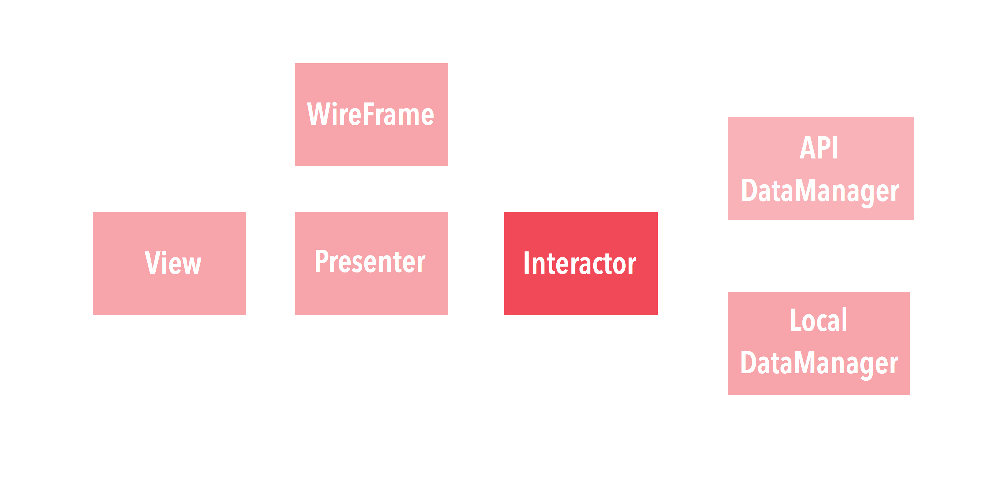
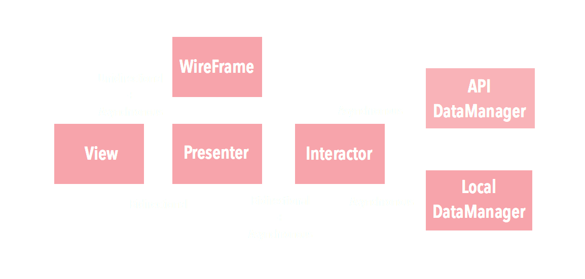
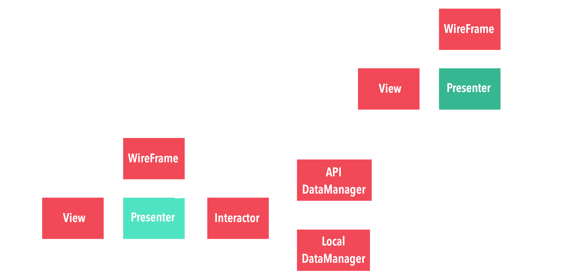
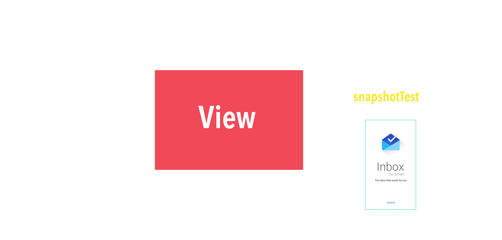
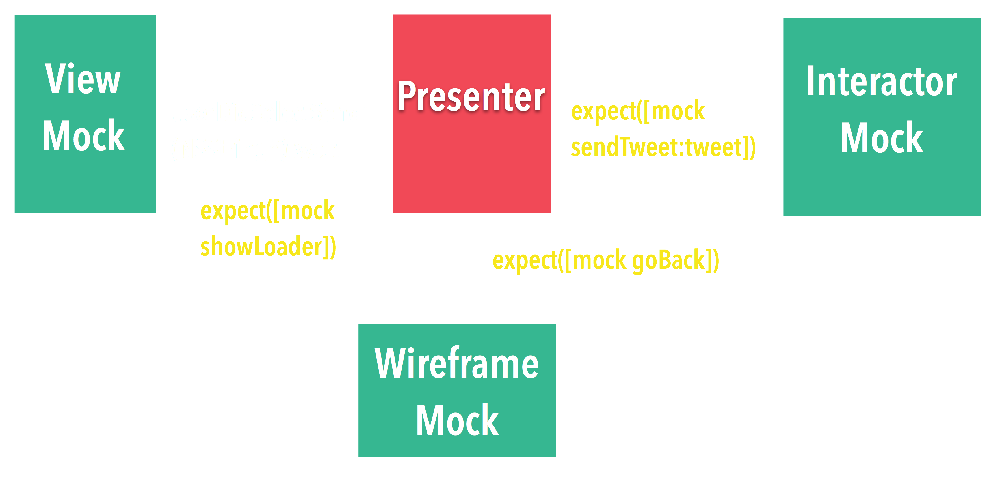
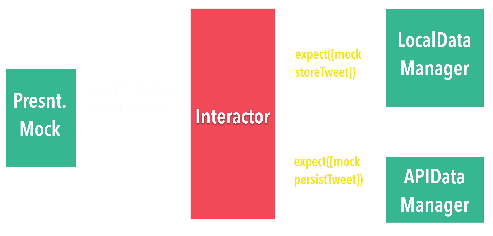
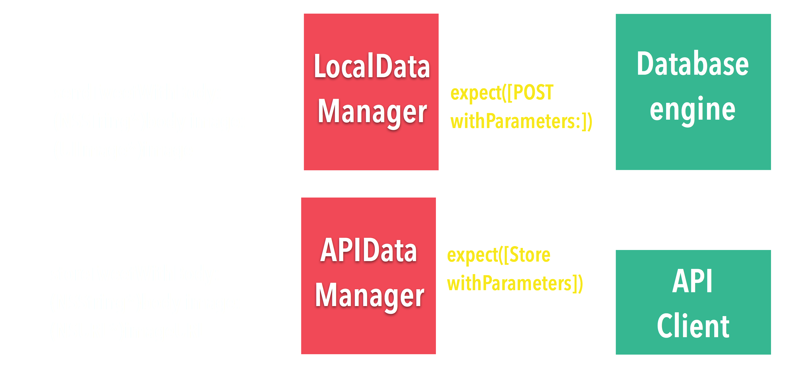
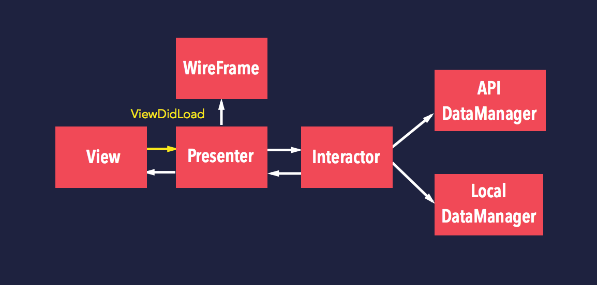
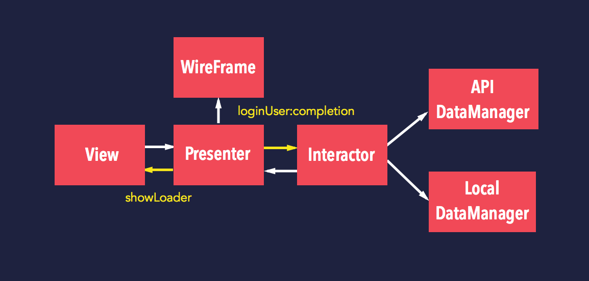

# _VIPER_
## Looking for the perfect architecture :dart:
##### _@pepibumur / @sergigracia / @saky_


---


### _Index_
- ViewControllers
- VIPER
- Communication
- Routing
- Testing
- Conclusions

---


# _Index_
- _ViewControllers_
- VIPER
- Communication
- Testing
- Conclusions

---

## Documentation, _books_, examples, _tutorials_
### __objc.io, RayWenderlich, iOS Dev Weekly, NSHipster__

---

# Patterns
## _Protocols_, _Delegates_, _Data Sources_
### _KVO_

---


---

## __Remember__
# They are examples

^Y por lo tanto no debemos seguir al pie de la letra. Deben servir junto con la documentación como algo orientativo. Un ejemplo de código tiene sentido en términos de implementación en el contexto del ejemplo pero si lo analizas en detalle seguramente vulnere los principios de Solid 

---

# ViewController

---

> # [fit] A _view controller_ coordinates its efforts with _model objects_ and other controller objects—including other view controllers
-- Apple

---

- View~~Controller~~Delegator

```objectivec
@interface TBThreadDetailViewController : RBViewController <UITableViewDataSource,
 UITableViewDelegate, RBViewControllerURLProtocol, NSFetchedResultsControllerDelegate, TBObjectDetailHeaderCellDelegate,
  TBUploadCellDelegate,TBWatchersViewDelegate>
```
:scream:
- Multi Responsibility

```objectivec
[self presentViewController:previewController animated:YES completion:nil]; //Navigation
[Task downloadNewObjectWithID:self.threadIdentifier.remoteIdentifier withSuccess:^{}]; // Networking
NSFetchRequest *request = [[NSFetchRequest alloc] initWithEntityName:[Comment entityName]]; // Data persistence
[self.view setBackgroundColor:ss_Color_White]; // Formatting
```
:weary:

---
- Monster files
_size > 1500 lines_ :cry:
- Impossible to test :expressionless:
- Components too coupled :anger:
- Hard to understand (and review) classes. :rage:
:walking::blush::computer::hushed::open_mouth::worried::shit::running:

---


---


---

## Clean Architecture
###_Independent from frameworks, UI, database and external entities. Easy to test_

---

- Who will _persist_ the data?
- And the _API_ interaction?
- Who controls the _navigation_?

---

# _Viper_
### View, Interactor, Presenter, Entity, and Routing
#### [obc.io - Viper](http://www.objc.io/issue-13/viper.html)
---


# _Index_
- ViewControllers
- _VIPER_
- Communication
- Testing
- Conclusions

---

# Why VIPER :heart:?

---


---


---


---

# _View_
- Shows the content received from the presenter
- Notifies user's actions to the presenter
- The presenter doesn't know anything about UI

---


---

# _Presenter_
- Includes the _logic_ to format the view
- Gets the _data_ from the interactor
- Receives _actions_ from the view and traduces them into: __Navigation actions (wireframe) and Interactor requests__

---



---

# _Interactor_
- Associated to an unique _use case_ of the application
- Works with _PONSO_ entities
- Easy to develop using _TDD_

---


---

# _DataManager_
- _Provider_ of entities for the Interactor
- Responsible of the _persistence_ (Web and Local)
- The entities don't know about how to persist themselves 

---


---

# _Wireframe_

- Initializes the VIPER module
- It knows _how to navigate_
- Delegate of _transitions animations_

---

# Keep in mind

---

## _Protocols_
### Dependency inversion
### Interface segregation
###### (Solid)

---

# Strong/Weak
#### Be careful with _retain cycles_ :loop:
```objc
@interface TweetDetailViewController: UIViewController
@property (nonatomic, strong) id <TweetDetailPresenterInput> presenter;
@end

@interface TweetDetailPresenter: NSObject<TweetDetailPresenterInput>
@property (nonatomic, weak) id <TweetDetailViewInput> view;
@end

@implementation TweetDetailPresenter
- (void)sendTweet:(NSString*)tweet
{
  __weak typeof(self) welf = self;
  [self.view showLoader];
  [self.interactor sendTweetWithCompletion:^(NSError *task) {
  	[welf.view hideLoader];
  	if (!error) [welf.wireframe moveBack];
  }];
}
@end
```
---

# Entities
### Don't pass _NSManagedObjects_!
##### Use _Ponsos_ instead

```objc
@interface TweetEntity: NSObject
@property (nonatomic, strong) NSString *body;
@property (nonatomic, strong) NSString *authorName;
@property (nonatomic, strong) NSDate *creationDate;
+ (TweetEntity*)tweetEntityFromTweet:(Tweet*)tweet;
@end
```

---


---


# _Index_
- ViewControllers
- VIPER
- _Communication_
- Testing
- Conclusions

---

# Inner communication

---



---

# Outer communication

---



---


---


### _Wait..._

---

# [fit] Testing

---


---


# _Index_
- ViewControllers
- VIPER
- Communication
- _Testing_
- Conclusions

---

# Testing _View_



---

# Testing _Presenter_



---

# Testing _Interactor_




---

# Testing _DataManager_



---

# Example

---

## _Twitter App_
### __Login and Home views__
### Written 100% in Swift
#### [github.com/pepibumur/viper-module-generator](http://github.com/pepibumur/viper-module-generator)
#### _Haneke, SugarRecord, Swifter, PureLayout, ProgressHUD_

---

# Login flow


---

* The VIPER module is _initialized_ and _presented_ by the __Wireframe__
* The view notifies that _DidLoad_ to the __Presenter__

```swift
override func viewDidLoad() {
    self.setupSubviews()
    self.setupConstraints()
    self.setNeedsStatusBarAppearanceUpdate()
    self.presenter?.viewDidLoad()
}
```



---

* The __Presenter__ formats the View's _content_

```swift
func viewDidLoad()
{
    self.view?.setLoginTitle("Login Twitter")
    self.view?.setLogo(UIImage(named: "twitter_logo")!)
}
```


---

When the _user taps on Login_

* The __View__ notifies the __Presenter__

```swift
func userDidSelectLogin(sender: AnyObject)
{
    self.presenter?.userDidSelectLogin()
}
```


---

The __Presenter__:

* Tells the __View__ to show a _loader_
* Asks the __Interactor__ for _Login_

```swift
func userDidSelectLogin()
{
    self.view?.showLoader()
    self.interactor?.login() { [weak self] (error: NSError?) -> () in
        if error != nil {
          // What should we do here?
        }
        else {
          self?.view?.hideLoader()
          // And here?
        }
    }
}
```



---

The __Interactor__:

* _Login_ the user through the __APIDataManager__
* _Persists_ the user's credentials using the __LocalDataManager__


---

```swift
func login(completion: (error: NSError?) -> ())
{
    self.APIDataManager?.login({ [weak self] (error: NSError?, credentials: TwitterLoginItem?) -> () in
        if (credentials != nil) {
            self?.localDatamanager?.persistUserCredentials(credentials: credentials!)
            completion(error: nil)
        }
        else {
            completion(error: error)
        }
    })
}
```

---

##### APIDataManager

```swift
func login(completion: (error: NSError?, loginItem: TwitterLoginItem?) -> ())
{
    TwitterClient.requestAccesss { (error, credentials) -> () in
        if credentials != nil {
            completion(error: nil, loginItem: TwitterLoginItem(swifterCredentials: credentials!))
        }
        else {
            completion(error: error, loginItem: nil)
        }
    }
}
```

---

##### LocalDataManager

```swift
func persistUserCredentials(#credentials: TwitterLoginItem)
{
    TwitterAccountManager.persistAccount(fromLoginItem: credentials)
}
```

---

_If the login fails_

* The __Presenter__ asks the __View__ to show an error

```swift
func showError(let errorMessage: String)
{
    ProgressHUD.showError(errorMessage)
}
```

_If the login success_

* The __Presenter__ asks the __Wireframe__ to show the home view


---

# Demo

---


# _Index_
- ViewControllers
- VIPER
- Communication
- Testing
- _Conclusions_

---

# _Some conclusions_

- Lighter, more specific and readable classes
- Each team member can be working on a different component once the interfaces are defined
- There're no excuses for TDD :stuck_out_tongue:

---

# _Tips_

- _Heavy work_ but you and you'll team will thank it
- Keep in mind the _SOLID principles_ 
- Refactor your components through _iterations_
- Decouple your code from the _database models_ and data layers

---

# _Resources_
- [VIPER Module Generator](https://github.com/teambox/viper-module-generator)
- [Objc.io post](http://www.objc.io/issue-13/viper.html)
- [Mutual Mobile Engineering blog post](http://mutualmobile.github.io/blog/2013/12/04/viper-introduction/)
- Dobuts/Ideas/Suggestions on Github issues

---


---

# :raised_hand:Doubts?

---

## __We are hiring!__
